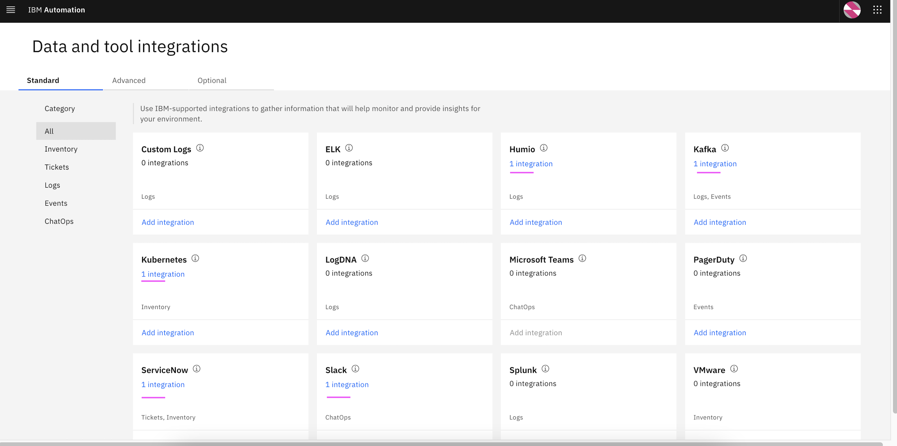
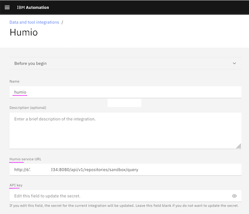
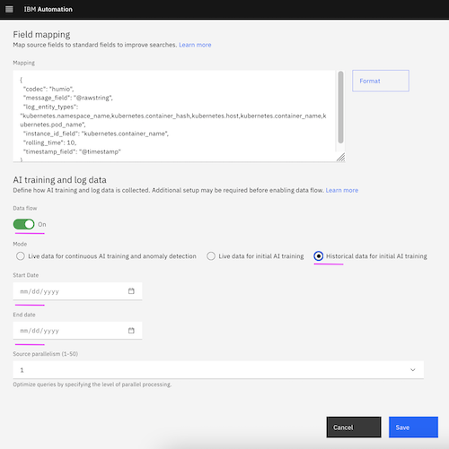
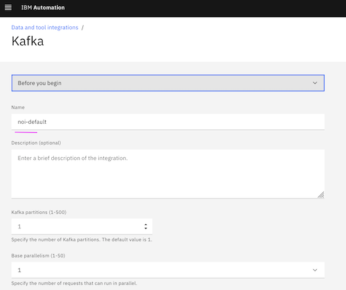
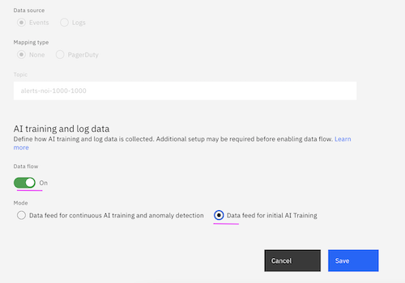
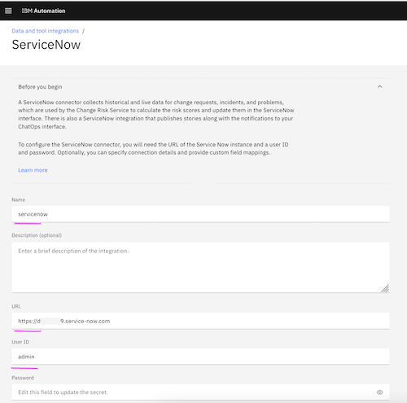
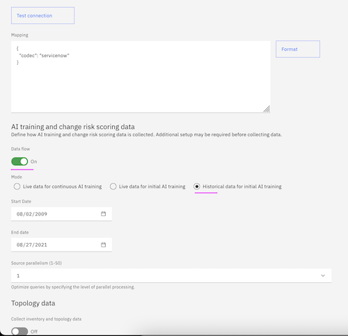
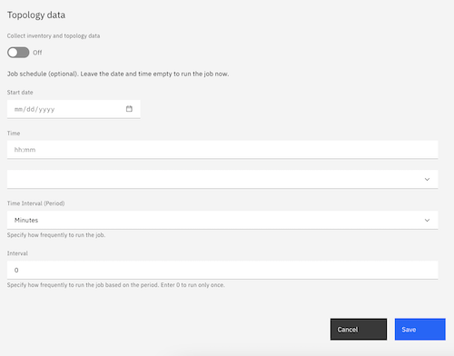
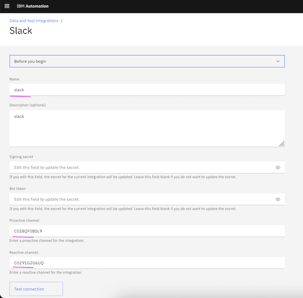

# WAIOps Demo with Instana and iLender App : 3 - Data and Tool Integrations

This article explains about integrations of the below tools with Watson AIOps for the Watson AIOps demo setup with Instana and iLender App.

- Humio (log)
- Kafka (Event Manager)
- ServiceNow (Incidents)
- Slack (Story)



The article is based on the the following.

- RedHat OpenShift 4.6.x / 4.7.x on IBM Cloud (ROKS)
- Watson AIOps 3.1.x


## Humio 

The logging system `Humio` to be integrated with Watson AIOps.

#### Enter the below field values

- Name 
- Humio sevice URL

    Sample value : http://1.1.1.1:8080/api/v1/repositories/sandbox/query

- API Key of the Humio
- Keep `Data flow` off


The detailed explanation is available in https://github.com/ibm-gsi-ecosystem/watson-ai-ops-310-guide/tree/main/300-aiops-initial-configuration/10-setup-humio-Integration




## Kafka

By default the Event manager is integrated with Watson AIOps as below.




## ServiceNow

The tickets/incidents system ServiceNow to be integrated with Watson AIOps.

#### Enter the below field values

```
- Name 
- URL
    Sample value : https://dev-11111.service-now.com

- UserID
- Password

- Data flow - on
- Historical Data for initial AI Training
- Start date (2 years old)
- End date (current date)
```

The detailed explanation is available in https://github.com/ibm-gsi-ecosystem/watson-ai-ops-310-guide/tree/main/300-aiops-initial-configuration/11-setup-servicenow-integration





## Slack

Watson AIOps creates incident as a story in chatops such as Slack or Teams. The below screenshot shows the slack integration with Watson AIOps.

The detailed explanation is available in https://github.com/ibm-gsi-ecosystem/watson-ai-ops-310-guide/tree/main/300-aiops-initial-configuration/13-slack-account-creation-and-integration




