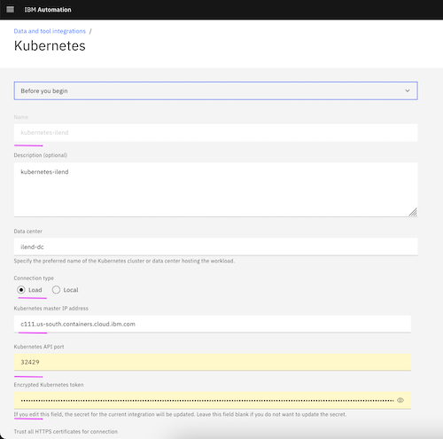

# WAIOps Demo with Instana and iLender App : 4 - Application Management

This article explains about application to be created in Watson AIOps as part of the Watson AIOps demo setup with Instana and iLender App.

The article is based on the the following.

- RedHat OpenShift 4.6.x / 4.7.x on IBM Cloud (ROKS)
- Watson AIOps 3.1.x

For detailed explanation refer https://github.com/ibm-gsi-ecosystem/watson-ai-ops-310-guide/tree/main/310-aiops-application-management/01-create-application

1. Create Kubernetes Observer for the app

2. Create Application using the observed group.

3. The application would look like this.

