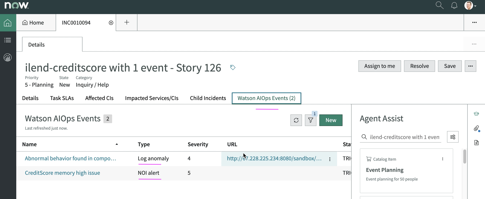

# WAIOps Demo with Instana and iLender App : 7 - Inferencing

This article explains about Inferencing Steps required as part of the Watson AIOps demo setup with Instana and iLender App.

- Generate load on the iLender App to simulate memory high issue in CreditScore Service
- Instana generates alerts and send to Event Manager as an event
- Humio logs observed by the AIManager detects the log anomaly
- Both the log anomaly and Instana Events get correlated 
- Slack story and ServiceNow Incident get created 

The article is based on the the following.

- RedHat OpenShift 4.6.x / 4.7.x on IBM Cloud (ROKS)
- Watson AIOps 3.1.x


## 1. Enabling Dataflow 

Make sure DataFlow is on in `Humio`, `Kafka` and `ServiceNow` integrations.

### Humio

Here `Data flow` is ON and it is in inferencing mode.


### Event Mgr (Kafka)

Here `Data flow` is ON and it is in inferencing mode.


### ServiceNow

Here `Data flow` is ON and it is in inferencing mode.


## 2. Before generating Load in app

Observe `Instana`, `Application Mgmt` and `Event Manager` before creating load in the iLender app.

### CreditScore service memory in Instana

The used percentage of `JVM memory` of the `CreditScore` service is `36%` only.


### iLender Application 

There is no error highlighted for `CreditScore` pod in the topology of the iLender application in Watson AIOps.


### Events in Event Manager

There is no event related to the `CreditScore` in Event manager.


## 3. Run the Demo Script

Demo script is available in [files/demo-scripts](files/demo-scripts).

This script will increase the load in the application and simulate the memory high problem in the creditscore.

### Update Config file

The config file `config.sh` to be updated.

#### Update API_URL

Update API_URL with the `frontweb` service url

```
API_URL=http://1.1.1.1:30500
```

#### Update API_URL_CREDIT_SCORE

Update API_URL with the `creditscore` service url

```
API_URL_CREDIT_SCORE=http://1.1.1.1:30501
```

## 4. Generate Load in app

1. Run the below command to start the demo script.

```
sh demo.sh
```

2. Choose the option 1 to generate load and simulate memory high problem.


## 5. After generating Load in app

Lets observe what is happend after the load is generated.

### Humio shows logs

Humio shows log entries from iLender app.


### Application Summary in Instana

 Application Summary shows no. of calls, latency and etc.


### Incident as Slack Story

Incident is created in slack. It shows Title, Description, links to servicenow incident, localization, blast radius, alerts and log anomalies count.


#### View Relevant Event

It shows the Instana event `Creditscore memory high issue` as an alert.

Click on `Show more` to see the event detail.


Click on `Show more` to see the event detail.


Click on `Show more` to see the log anomaly detail.


Click on `Preview logs` to see the logs detail.


Click on `Search Similar Incident` to open Similar incidents window.

#### View Similar Incidents

Click on `Search` to see the Similar incidents list.


Similar incidents list is displayed.

Click on any of the similar incident to see its details.


The similar incident detail is displayed in ServiceNow.


#### Blast Radius

Click on the blast radius link in the slack story to view the blast radius.


#### Incident

Click on the `Incident` link to see the incident created for the memory issue in servicenow .


See the 2 events associated with this incident.



#### Credit Score service memory in Instana

Observe the memory high in Instana


See the incident created in Instana


#### Event in Event Manager

See the Event in Event Manager


## Story in WebConsole

See the application screen contains the stories.


Click on the `View Details` link to see the story details in webconsole .


