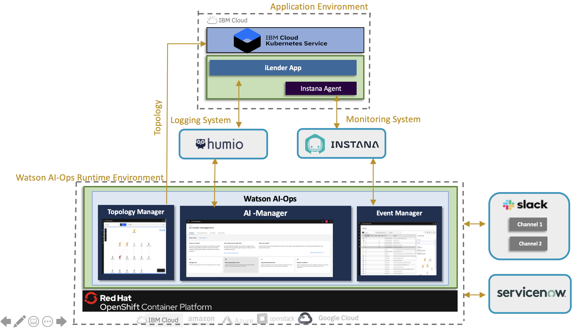

# Watson AIOps Demo Setup with Instana and iLender App

This article explains about step by step process involved in setting up `Watson AIOps` Demo with `Instana` and `iLender` Application.

The article is based on the the following.

- RedHat OpenShift 4.6.x / 4.7.x on IBM Cloud (ROKS)
- Watson AIOps 3.1.x

# Overview

iLender is a Microservices based Loan processing application used by a FinTech company. This application is deployed in a kubernetes environment. 

The application pushses logs to `Humio` logging system. 

The managed environment is monitored using the `Instana` monitoring system.

`Watson AIOps 3.1.x` is installed on ROKS and it is connected to these `Humio` and `Instana`. Apart from these, it is also connected to `ServiceNow` and ChatOps `Slack`

Here are steps to be done for this demo setup.

- Initial configuration or tools installation including the iLender app 
- Integrate external tools in WAIOps
- Import application topology from managed environment and create application in WAIOps
- Create AI Model definition
- Training of Normal Logs, events and Similar incidents
- Induce error in the iLender Application (memory high issue in CreditScore Service) and view the slack story and servicenow incident.

# Initial Configuration

This section explains about the Initial Configuration or tools installation required to do the demo setup. This section also explains about how to install the iLender application.

Refer : [initial-configuration](02-initial-configuration)

## Data and tool integrations

This section explains about the below tools integrations with Watson AIOps.

- Humio (log)
- Kafka (Event Manager)
- ServiceNow (Incidents)
- Slack (Story)

Refer : [data-and-tool-integrations](03-data-and-tool-integrations)

## Application Management

This section explains about observing iLender application topology through kubernetes observer and how to create application in Watson AIOps.

Refer : [application-management](04-application-management)

## AI Model management

This section explains about how to create ai-model management for Logs, Events and Similar incidents.

Refer : [ai-model-management](05-ai-model-management)

## Training

This section explains about how to do training for Logs, Events and Similar incidents.

Refer : [training](06-training)

## Inferencing

This section explains about Inducing error in the iLender Application (memory high issue in CreditScore Service), get alert from Instana, log anomaly AIManager through Humio and view the slack story and servicenow incident.

Refer : [inferencing](07-inferencing)

